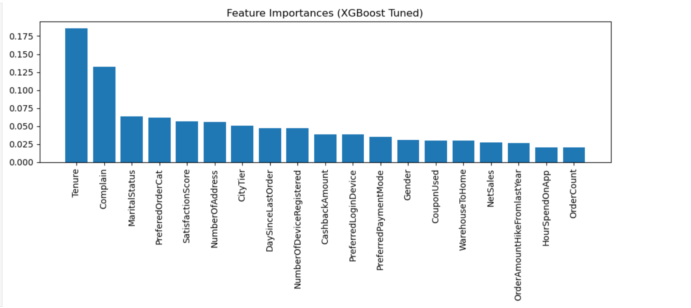
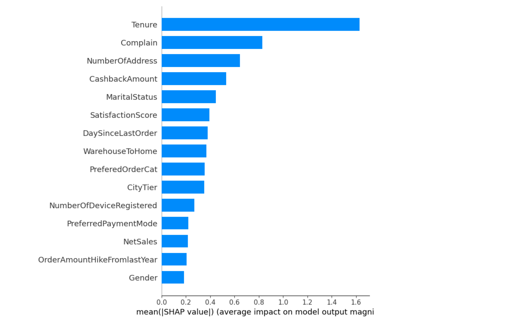
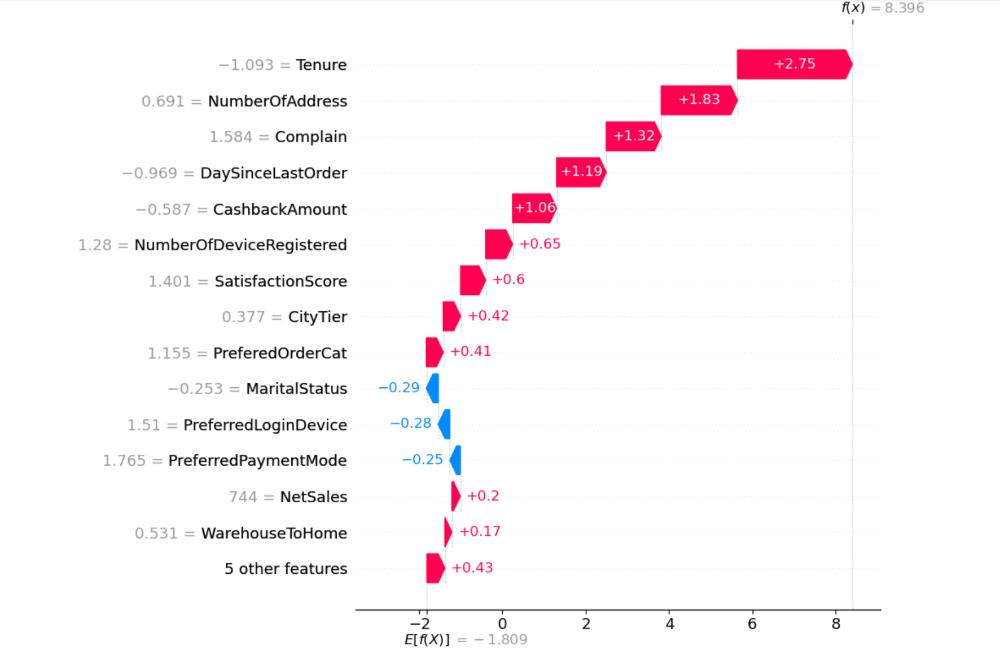

# Customer Churn Analysis (ML + Power BI)

---

### Business Objective

The e-commerce company wanted to answer key questions:

- Which customers are at risk of churning?  
- What drives churn? (risk factors)  
- Which retention actions are most profitable?  

→ There was no tool combining predictive analysis (ML) with business simulations (Power BI).

---

### Solution

The project consists of two components:

**1. Predictive Model (Jupyter Notebook)**  
- Data prepared in Python (pandas, scikit-learn).  
- XGBoost model for churn prediction.  
- SHAP explainability → key drivers of churn (tenure, complaints, cashback, satisfaction).  

**2. Business Dashboard (Power BI)**  
- Customer segmentation by risk (low / medium / high).  
- Impact analysis of churn on sales, product categories, and payment methods.  
- ROI simulation module for retention actions (e.g., discounts, calls, email campaigns).  

---

### Key Views

**1. Business Overview**  
→ Shows how much revenue is at risk and how churn risk is distributed by categories, payments, and customer tenure.  


---

**2. Churn Details**  
→ Identifies risk factors: satisfaction, complaints, cashback, tenure.  
→ List of customers with recommended actions.  


---

**3. Simulations & Recommendations**  
→ Interactive module: how net profit changes under different retention strategies.  
→ ROI for discounts and campaigns → supports budget allocation decisions.  


---

**4. Feature Importances (ML)**  
→ XGBoost model shows which features have the greatest impact.  



---

**5. Explainability (SHAP)**  
→ SHAP summary & beeswarm: global feature impact.  
→ SHAP waterfall: single-customer interpretation.  

  
  


---

### Repository Structure
```bash
Churn_analysis/
├── Churn.ipynb              # ML notebook – data, model, SHAP
├── bi.pbix                  # Power BI dashboard
├── requirements.txt         # Dependencies for the notebook
├── README.md                # Project documentation
└── screenshots/             # Screenshots for README
```

---
### How to Run (ML Part)
Create a virtual environment:
```bash
python -m venv .venv
source .venv/bin/activate   # Linux/Mac
.venv\Scripts\activate      # Windows
```

### Install requirements:
```bash
pip install -r requirements.txt
```

### Open notebook:

jupyter notebook Churn.ipynb

---

### Key Insights

- The biggest drivers of churn: tenure, complaints, cashback, and customer satisfaction.
- Risk-based segmentation enables focusing retention efforts on groups with the highest ROI.
- Power BI simulations show that some retention campaigns are not profitable (cost > saved revenue).
---
### Tech Stack

- Python (pandas, scikit-learn, XGBoost, shap, matplotlib, seaborn)

- Jupyter Notebook

- Power BI
---
Note on Dashboard Language
The Power BI dashboard uses Polish labels.
### Dashboard Labels (Polish → English) examples:

- Sprzedaż całkowita &rarr; Total Sales  
- Satysfakcja klientów &rarr; Customer Satisfaction  
- Liczba klientów &rarr; Number of Customers  
- Ryzyko odejścia &rarr; Churn Risk  
- Staż klienta &rarr; Customer Tenure  
---
Summary
The project demonstrates how to combine ML modeling with an intuitive business dashboard – from prediction, through model explainability, to actionable recommendations.
