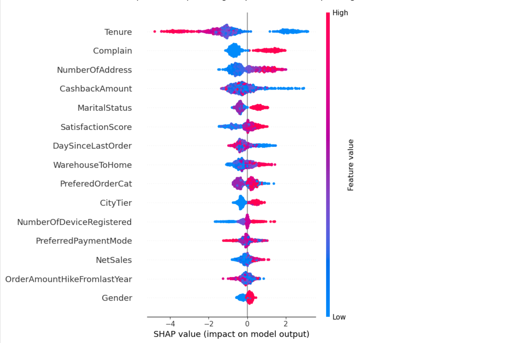

# Customer Churn Analysis (ML + Power BI)
---
### Cel biznesowy

Firma e-commerce chciała odpowiedzieć na kluczowe pytania:

- Którzy klienci są zagrożeni odejściem?

- Co napędza churn? (czynniki ryzyka)

- Jakie działania retencyjne są najbardziej opłacalne?

&rarr;  Brakowało narzędzia, które łączy analizę predykcyjną (ML) z symulacjami biznesowymi (Power BI).

---

### Rozwiązanie

Projekt składa się z dwóch komponentów:

**1. Model predykcyjny (Jupyter Notebook)**

- Dane przygotowane w Pythonie (pandas, scikit-learn).

- Model XGBoost do predykcji churn.

- SHAP explainability → które cechy (tenure, reklamacje, cashback, satysfakcja) najmocniej wpływają na ryzyko odejścia.


**2. Dashboard biznesowy (Power BI)**

- Segmentacja klientów wg ryzyka (niskie/średnie/wysokie).

- Analiza wpływu churnu na sprzedaż, kategorie produktów, metody płatności.

- Moduł symulacji ROI działań retencyjnych (np. rabaty, telefony, kampanie e-mail).

---

### Kluczowe widoki
**1. Kondycja biznesu**

&rarr; Pokazuje ile przychodów jest zagrożonych oraz jak ryzyko rozkłada się po kategoriach, płatnościach i stażu klienta.


**2. Analiza szczegółowa churn**

&rarr; Identyfikacja czynników ryzyka: satysfakcja, reklamacje, cashback, długość współpracy.
&rarr; Lista klientów z rekomendacjami działań.


**3. Symulacje i rekomendacje**

&rarr; Interaktywny moduł: jak zmienia się zysk netto przy różnych strategiach retencji.
&rarr; ROI dla rabatów i kampanii → decyzje o alokacji budżetu.


**4. Feature Importances (ML)**

&rarr; Model XGBoost pokazuje, które cechy mają największy wpływ.


**5. Explainability (SHAP)**

&rarr; SHAP summary & beeswarm: wpływ cech globalnie.
&rarr; SHAP waterfall: interpretacja pojedynczego klienta.

  
  


---

### Struktura repozytorium
```bash
Churn_analysis/
├── Churn.ipynb              # Notebook ML – dane, model, SHAP
├── bi.pbix                  # Dashboard Power BI
├── requirements.txt         # Biblioteki do uruchomienia notebooka
├── README.md                # Dokumentacja projektu
└── screenshots/             # Screeny do README
```

---
### Jak uruchomić (część ML)

Stwórz środowisko:
```bash
python -m venv .venv
source .venv/bin/activate   # Linux/Mac
.venv\Scripts\activate      # Windows
```

### Zainstaluj zależności:
```bash
pip install -r requirements.txt
```

### Otwórz notebook:

jupyter notebook Churn.ipynb

---

### Kluczowe wnioski

- Największy wpływ na churn miały: czas współpracy (tenure), reklamacje, cashback oraz satysfakcja klienta.

- Segmentacja wg ryzyka pozwala skupić działania na grupach o najwyższym ROI.

- Symulacje w Power BI pokazują, że część kampanii retencyjnych jest nieopłacalna (koszt > uratowany przychód).
---
### Stack technologiczny

- Python (pandas, scikit-learn, XGBoost, shap, matplotlib, seaborn)

- Jupyter Notebook

- Power BI
---
### Projekt pokazuje, jak połączyć modelowanie ML z intuicyjnym dashboardem biznesowym – od predykcji, przez wyjaśnienie modelu, aż po konkretne rekomendacje działań.